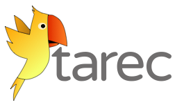

# The Awesome REact CLI

[](https://www.npmjs.com/package/tarec)
[](https://travis-ci.org/geowarin/tarec)
[](https://coveralls.io/github/geowarin/tarec?branch=master)

Tarec takes care of your React build for you. No more googling and stitching boilerplates together. Just write your application.

## Features

Tarec takes all the best practices in the React community and makes them available to you via a Command-Line Interface (CLI).

* Instant project generation
* Babel 6 stage 0
* Great developer experience with webpack errors analysis and desktop notifications
* Tree-shaking with webpack 2
* Hot reloading with react-hmr
* Great DX experience with build notifications and clean error messages
* Pre-configured loaders for all resources (images, fonts, json, ...)
* Separate bundles for vendors and your code (css and js)
* Cache-busting
* Static resources
* Index.html fallback (for the router)
* Simple babel aliases configuration
* Simple plugins system to add support for sass or mocha
* Publish on github pages
* Support [DLLs](http://engineering.invisionapp.com/post/optimizing-webpack/) for faster development
* Mutithreaded compilation with [happypack](https://github.com/amireh/happypack)

## Documentation

Read [the documentation](http://geowarin.github.io/tarec/)

## How-to

1. `npm install -g tarec`
2. `mkdir my-react-app && cd my-react-app`
3. `tarec init`
3. `npm install`
4. `tarec start`

Use `tarec start` to launch a dev-server with hot-reload and `tarec build` to generate the optimized version of your application
in the `dist` folder.

## Requirements

Node 6+ and npm 3+.

## Caveats

Webpack 2 is still in beta. Some loaders have not updated to the newer peer dependency even though they are fully compatible.
This means that you will get warnings about unresolved peer dependencies when installing tarec.

In most case, with npm 3, this is not a big deal but it will prevent you from using shrinkwrap.

This issue will most certainly go away once webpack 2 is out of beta.
You can follow those issues on the faulty loaders' repositories:

* [babel-loader](https://github.com/babel/babel-loader/issues/239)
* [extract-text-webpack-plugin](https://github.com/webpack/extract-text-webpack-plugin/issues/168)
* [webpack-dev-middleware](https://github.com/webpack/webpack-dev-middleware/issues/45)

## Configuration

### index.html

If no `index.html` is found at the root of your project, one will be generated for you.
If you provide one, css and scripts will be injected for you,
as described in the [html-webpack-plugin](https://github.com/ampedandwired/html-webpack-plugin).

### Static resources

All the files in the `public` directory of your project will be served by the dev server and will be copied
as-is int the `dist` directory.

### Happypack

[Happypack](https://github.com/amireh/happypack) will build your css and js file by file in parallel, which
can decrease your build time in development.

By default, happypack is disabled. You can enable it with a command-line flage (`tarec start --happy`) or
configure it in your `tarec.yml` file:

```yml
happypack:
  enabled: true    # default = false
  cache: true       # default = true
  cpus: 4             # default = os.cpus().length
```

Happypack is only used in development mode.

### Notifications

By default, tarec will display an os notification on build errors.
This can be very handy because you don't always have the console visible when coding.
But if you are annoyed by this feature, you can disable it:

```yml
build:
  # show notifications on build failure. Default, true
  showNotification: true
```


### Babel aliases

Create a `tarec.yml` file and configure [aliases](https://github.com/tleunen/babel-plugin-module-alias) like this:

```yaml

aliases:
  - components: ./src/components
  - reducers: ./src/reducers

```

### Proxies

If you are targeting an api running on a different port or another host, it can be useful to create a proxy in development.

You can add as many proxies as you want in your `tarec.yml` file:

```yaml

proxies:
  - /api: http://localhost:8080

```

The above configuration will redirect every request made to `${yourServerUrl}/api` to `http://localhost:8080/api`

### Variable definitions

In your build process, it can be useful to define variables that will be available
from your application.

For instance, we can define an `API_URL` variable in the `tarec.yml` file:

```yaml
define:
  - API_URL: http://localhost:8080
  - API_URL2: ${ENV_VAR:http://localhost:9090}
```

In the above example, API_URL will be resolved as a string whose value is always
`http://localhost:8080`.

`API_URL2` will take its value from an environment variables
called `ENV_VAR` if it is defined, and default to `http://localhost:9090`, otherwise.

We can now use the variable directly in our application:

```javascript
console.log(API_URL);
```

### DLLs

When you start your application in development mode, webpack will go through every asset and library to resolve the imports
you wrote.
While your code changes on a regular basis, your dependencies do not.
It is thus wasteful to re-link them on every build.

[DLLs](http://engineering.invisionapp.com/post/optimizing-webpack/) solve that problem by allowing you to pre-bundle
all your dependencies in a single js file. A manifest file will also be generated so webpack knows how to wire
those dependencies to your code.

Every time your dependencies change, run `tarec dll` to regenerate your project's dlls.
They will be put in the `.tarec/dll` folder, at the root of your project.

When tarec starts (`tarec start`), it will look in this directory and automatically pick up those dlls.
Webpack will therefore only compile your own code.

On projects with lots of dependencies, this call yield a very significant performance boost on both startup and
rebuild time.

DLLs are only used in development mode.

### Plugins

Tarec has a powerful, yet simple plugin system.
Plugins can add new commands or modify existing commands.

For instance, [tarec-plugin-mocha-test](https://github.com/geowarin/tarec-plugin-mocha-test) adds support for mocha
and [tarec-plugin-sass](https://github.com/geowarin/tarec-plugin-sass) adds support for sass.

To use a plugin, install them as devDependencies and add them to your `tarec.yml` configuration file:

```yaml

plugins:
  - tarec-plugin-mocha-test
  - tarec-plugin-sass

```

You can also resolve local plugins:


```yaml

plugins:
  - ./myAwesomePlugin.js

```

## Todo

* React-Hot-Loader 3?
* Support server compilation and universal apps
* Typescript

# Thanks

[@mrasoahaingo](https://github.com/mrasoahaingo) for the logo!
